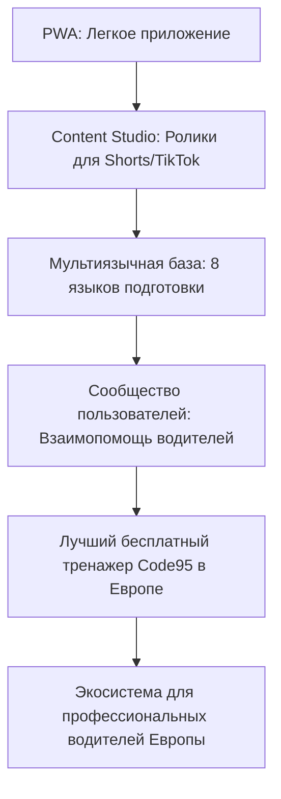

# Driver95 Vision

## 🎯 Миссия
**Driver95** существует для того, чтобы сделать процесс подготовки к государственному экзамену на Код 95 в Польше максимально простым, доступным и безбарьерным для профессиональных водителей из стран Восточной Европы (Украина, Беларусь, Молдова и др.). Мы убираем страх перед государственным тестом, помогая преодолеть языковой барьер с помощью удобного двуязычного тренажера.

---

## 👥 Для кого (Целевая аудитория)
* **Основной пользователь**: Водители-дальнобойщики и водители автобусов, приехавшие на работу в Польшу и проходящие курс Kwalifikacja wstępna (или Kwalifikacja wstępna przyspieszona).
* **Портрет**: Мужчины и женщины, часто находящиеся в дороге или на парковках, имеющие ограниченное время для учебы, ценящие автономность приложения и работу без перебоев связи.

---

## 🛠️ Какие проблемы мы решаем
Мы решаем проблемы на протяжении всего пути получения Кода 95:
1. **Языковой барьер**: Возможность учить вопросы на родном языке (русском/украинском) с мгновенным сопоставлением с польским оригиналом (WORD).
2. **Нестабильный интернет**: Обучение на паркингах и трассах Европы без необходимости постоянного онлайн-соединения.
3. **Хаос в подготовке**: Систематизация процесса (через отслеживание ошибок, прогресса правильных ответов и избранных вопросов).

---

## 🛑 Что НЕ является целью проекта
* **Не LMS (Learning Management System)**: Мы не создаем тяжелую платформу для онлайн-курсов с лекциями, вебинарами и домашними заданиями.
* **Не автошкола**: Мы не заменяем официальные польские автошколы (szkoły jazdy), а выступаем вспомогательным инструментом для самоподготовки.
* **Не социальная сеть**: Мы не строим внутренние чаты, профили пользователей и ленты новостей.

---

## 💎 Главные принципы
1. **Offline-first**: Приложение работает всегда и везде, даже без интернета.
2. **Минимум кликов**: Запуск приложения ➔ Выбор языка ➔ Старт тренировки. Никаких лишних действий.
3. **Максимально быстрый старт**: Пользователь должен начать отвечать на вопросы за 3 секунды после открытия сайта.
4. **Никакой регистрации**: Никаких логинов, паролей, номеров телефонов или e-mail. Все данные остаются в браузере.
5. **Никакой рекламы**: Фокус только на обучении. Никаких баннеров, видеовставок и отвлекающих факторов.
6. **Максимально честная статистика**: Реальная история ответов по каждому вопросу без приукрашивания результатов.

---

## 🌟 Северная звезда проекта (North Star Metric)
Через год активный пользователь Driver95 должен сказать:
> **"Это лучший бесплатный тренажер Code 95 в Европе."**

---

## 📐 Принципы принятия решений (Decision Framework)
При возникновении спорных вопросов или выборе фич мы руководствуемся правилами:
1. **Что быстрее для пользователя?** (Приоритет отдается скорости работы интерфейса и быстроте доступа).
2. **Что проще поддерживать?** (Выбираем архитектуру с минимальным техническим долгом и без бэкенда).
3. **Что не ломает существующий UX?** (Избегаем усложнения интерфейса новыми кнопками и экранами).
4. **Что можно реализовать без бэкенда?** (Используем локальные возможности браузера — localStorage, Web API).

---

## 🚀 Долгосрочное видение (Roadmap Progression)

* **Экосистема будущего**: Развитие Driver95 в единый хаб полезных инструментов для водителей (калькуляторы рабочего времени тахографа, оффлайн-справочники штрафов, инструкции по креплению грузов и т.д.).
